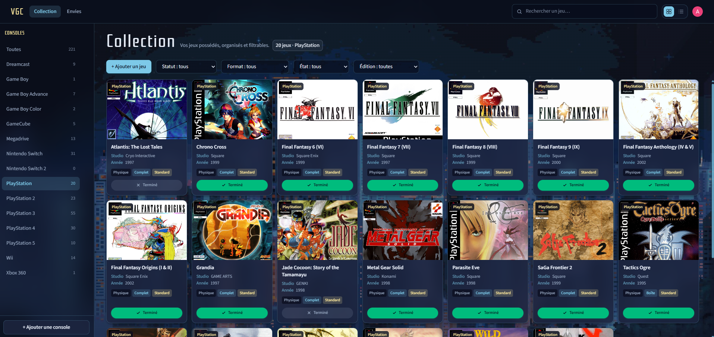

# Video Game Collection

## Un projet de gestion de collection de jeux vidéo👋

Amoureux de jeux vidéo, j'avais envie de créer un outils de gestion de ma petite collection dans une app dédiée, claire et filtrable.

## Contenu de l'application

🏠 __Accueil__ : une landing de présentation avec authentification (connexion / inscription via Clerk).

🎮 __Collection__ : l'inventaire des jeux possédés, organisés par console.

- ajout et édition d'un jeu (titre, studio, année, jaquette, métadonnées).
- suivi du statut (terminé ou non), du format (physique / digital), de l'état (complet, boîte, livret, loose…) et de l'édition.
- recherche, filtres et bascule grille / liste.

💫 __Envies__ : une wishlist pour les jeux à acquérir, sur le même modèle que la collection.

🕹️ __Consoles__ : une barre latérale pour filtrer par hardware, avec compteurs et possibilité d'ajouter une console.

🔍 __Catalogue__ : recherche de jeux et de jaquettes via [RAWG](https://rawg.io/apidocs) pour préremplir les fiches.

## Les outils de création 🛠️

### 💻 Front-end

VGC est une __single page application__ (SPA) construite avec __React 19__ et bundlée via __Vite__.

- __React Router__ gère la navigation (accueil, collection, wishlist, auth).
- __TypeScript__ type l'ensemble de l'interface et des modèles métier.
- __Tailwind CSS__ assure le styling des composants.
- __Clerk__ gère l'authentification (connexion, inscription, routes protégées).

### ⚡ Back-end (serverless)

Il n'y a pas de serveur Node.js permanent : l'API repose sur des __Serverless Functions Vercel__ situées dans le dossier `api/`.

Chaque fichier de ce dossier devient un endpoint HTTP autonome, démarré à la demande puis arrêté une fois la requête traitée :

- `/api/games` — CRUD des jeux de la collection / wishlist
- `/api/consoles` — lecture et écriture des consoles
- `/api/catalog/games` — recherche et détail de jeux (RAWG)
- `/api/catalog/platforms` — plateformes du catalogue
- `/api/catalog/covers` — jaquettes alternatives

Les routes sensibles passent par une vérification Clerk côté API.

### 🗄️ Base de données

Les données sont stockées dans __MongoDB Atlas__, accessible via le driver officiel `mongodb`.

Collections principales :

- `games` — jeux possédés et envies
- `consoles` — hardwares de la collection

## Le Déploiement 🚀

### ☁️ Coté Front & API

Le projet est déployé sur [vercel.com](https://vercel.com) à l'adresse [https://video-game-collection-six.vercel.app/](https://video-game-collection-six.vercel.app/) (projet Vercel **dédié**, distinct du blog).

Une fois lié au compte GitHub, Vercel redéploie automatiquement à chaque mise à jour : le build Vite du front et les fonctions serverless de `api/` sont publiés ensemble.
